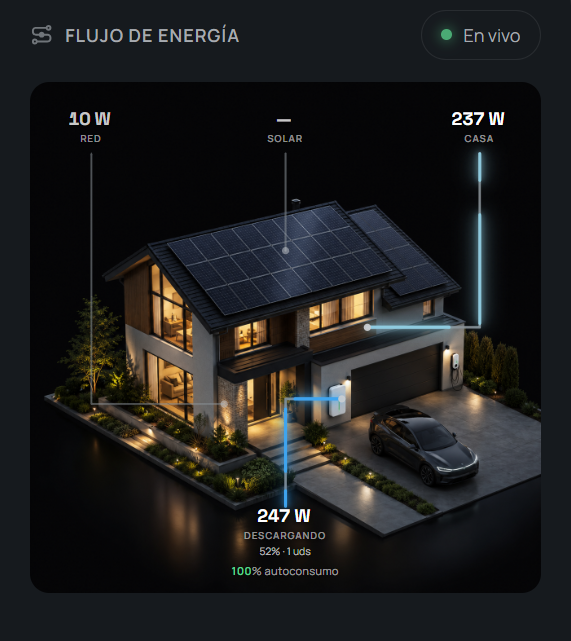

# 🏠 3D Power Flow Card for Home Assistant

<p align="center">
  
</p>

<p align="center">
  A custom Lovelace card displaying your home's real-time energy flow over an isometric 3D house render, with neon-glowing animated SVG paths, automatic day/night background switching and per-device consumption overlays (pool, dryer, washer, fridge, vitroceramic, EV charger…).
</p>

<p align="center">
  <a href="https://github.com/AbuAwn/lovelace-3d-power-flow-card/releases/latest"></a>
  <a href="https://github.com/AbuAwn/lovelace-3d-power-flow-card/blob/main/LICENSE"></a>
</p>

---

## ✨ Features

- **🌅 Dynamic Day & Night 3D Renders** — Switches between the daytime (`home_all_day.jpeg`) and nighttime (`home_all_night.jpeg`) isometric renders based on `sun.sun` or solar production.
- **⚡ Animated Neon Energy Flows** — Color-coded glowing SVG paths with directional animations:
  - 🟣 **Purple** — Grid Import
  - 🟠 **Orange** — Grid Export
  - 🟡 **Amber / Gold** — Solar Generation
  - 🔵 **Cyan** — House Consumption & Battery Discharge
  - 🟢 **Green** — Battery Charging
- **🔌 Individual Device Overlays** — Superimpose live consumption of your appliances directly on the house:
  - 🏊 Filtrado piscina (`pool`)
  - 🌀 Secadora (`dryer`)
  - 🫧 Lavadora (`washer`)
  - 🧊 Nevera (`fridge`)
  - 🍳 Vitrocerámica (`vitro`)
  - 🚗 Cargador del coche (`ev`)
  - …and the **Resto** (remaining unmonitored load) stays at the bottom of the image.
- **📡 "Cargas si seguimiento"** — Only devices with a configured `entity` are monitored and shown. A device without an entity is simply not rendered.
- **🔢 Auto Home Load Calculation** — If no `load` entity is set: `Home Load = Solar + Grid Import − Battery Charge + Battery Discharge`.
- **📊 Real-time Self-Consumption (Autoconsumo)** — Percentage of load covered by local sources.
- **🔢 Universal Unit Support** — Automatically converts `W` / `kW` sensor states.

---

## 📦 Installation

1. **HACS**: *HACS → Frontend → ⋮ → Custom repositories* → add `https://github.com/AbuAwn/lovelace-3d-power-flow-card` (category **Lovelace**) → install **3D Power Flow Card**.
2. **Copy the backgrounds** (required — they are NOT embedded). Copy `home_all_day.jpeg` and `home_all_night.jpeg` into your `config/www/` folder so they are reachable at:
   - `/local/home_all_day.jpeg`
   - `/local/home_all_night.jpeg`

   > If you rename them, update `day_image` / `night_image` in the config below.
3. Reload your browser (`Ctrl+F5`).

---

## ⚙️ Configuration Example

```yaml
type: custom:lovelace-3d-power-flow-card
title: FLUJO DE ENERGÍA
entities:
  grid: sensor.potencia_red_invertida
  solar: sensor.produccion_solar_total
  battery: sensor.hoymiles_hybride_battery_power
  battery_soc: sensor.hoymiles_hybride_battery_soc
  # load: sensor.consumo_casa_total   # Optional: auto-calculated if omitted

invert_grid: true     # see Sign Convention below
battery_units: 1

# The 6 appliance overlays — only those with an entity are monitored/shown.
individual:
  - entity: sensor.filtrado_piscina
    name: Piscina
    type: pool
    display_zero: false        # hide the chip when off

  - entity: sensor.secadora
    name: Secadora
    type: dryer
    display_zero: false

  - entity: sensor.lavadora
    name: Lavadora
    type: washer
    display_zero: false

  - entity: sensor.nevera
    name: Nevera
    type: fridge

  - entity: sensor.vitroceramica
    name: Vitrocerámica
    type: vitro
    display_zero: false

  - entity: sensor.cargador_coche
    name: Coche
    type: ev
    display_zero: false
```

---

## 🔌 Individual Devices

Each entry in `individual` represents a monitored appliance. The card reads its power from `entity` and draws:
- a **chip** (colored dot + name + live power) at its position on the image, and
- an **animated flow path** from the house load node to that position.

### Fields

| Field | Type | Description |
|---|---|---|
| `entity` | string | **Required** — HA power sensor. If omitted, the device is not monitored and is not rendered ("cargas si seguimiento"). |
| `name` | string | Display label. Defaults to the `type` preset label. |
| `type` | string | Preset icon/color/position (see table). If omitted, it is inferred from the name (Spanish + English keywords). |
| `icon` | string | Override the MDI icon. |
| `color` | string | Override the accent color (CSS color). |
| `top` / `left` | string | Override the chip position on the image, e.g. `top: '48%'`, `left: '76%'`. |
| `display_zero` | boolean | `true` (default): always show the chip (shows `0 W` when off). `false`: hide the chip and its flow when off. |
| `display_zero_tolerance` | number | Power (W) below which the device is considered off. Default `1`. |

### `type` presets (default positions are for the bundled renders)

| `type` | Appliance | Icon | Color |
|---|---|---|---|
| `pool` | Filtrado piscina | `mdi:pool` | Cyan |
| `dryer` | Secadora | `mdi:tumble-dryer` | Amber |
| `washer` | Lavadora | `mdi:washing-machine` | Sky blue |
| `fridge` | Nevera | `mdi:fridge` | Light blue |
| `vitro` | Vitrocerámica | `mdi:stove` | Red |
| `ev` | Cargador del coche | `mdi:ev-station` | Green |
| `heater` | Calentador | `mdi:water-boiler` | Orange |
| `ac` | Aire acondicionado | `mdi:air-conditioner` | Light blue |
| `boiler` | Caldera | `mdi:fire` | Orange |
| `oven` | Horno | `mdi:stove` | Orange |
| `dishwasher` | Lavavajillas | `mdi:dishwasher` | Blue |

### "Resto" (remaining load)

When `individual` devices exist, the card automatically computes and displays the remaining house load as a **RESTO** chip at the bottom of the image:

```
Resto = Home Load − Σ(individual devices)
```

It only appears while there is remaining load (> 5 W). Disable it with `show_other: false`.

### Adjusting positions

The default positions are tuned for the bundled renders. Because the SVG overlay uses a `0…100` coordinate space over the square image, `top`/`left` percentages are also the flow endpoints. To move a device, override `top` and `left`:

```yaml
  - entity: sensor.nevera
    name: Nevera
    type: fridge
    top: '42%'      # vertical position (0% = top)
    left: '58%'     # horizontal position (0% = left)
```

---

## 🔄 Sign Convention — Critical for Correct Readings

### Grid sensor (`entities.grid`)

| Sensor State | Meaning |
|---|---|
| Positive (`> 0`) | Importing from grid (default expected) |
| Negative (`< 0`) | Exporting to grid (default expected) |

If your grid sensor is inverted (negative = importing), set `invert_grid: true`.
> **Auto-detection:** if the entity id contains `invertid`, `invert_grid` is enabled automatically.

### Battery sensor (`entities.battery`)

| Sensor State | Meaning |
|---|---|
| Negative (`< 0`) | Discharging (Hoymiles default) |
| Positive (`> 0`) | Charging (Hoymiles default) |

If your battery sensor uses the opposite convention (positive = discharging), set `invert_battery: true`.

---

## 📋 Configuration Options

### `entities` (Required)

| Key | Type | Required | Description |
|---|---|---|---|
| `entities.grid` | string | **Required** | Grid power sensor |
| `entities.solar` | string | Optional | Solar production sensor |
| `entities.battery` | string | Optional | Battery power sensor |
| `entities.battery_soc` | string | Optional | Battery state of charge (%) |
| `entities.load` | string | Optional | Home load sensor (auto-calculated if omitted) |

### Card Options

| Option | Type | Default | Description |
|---|---|---|---|
| `title` | string | `FLUJO DE ENERGÍA` | Header title |
| `individual` | list | `[]` | Monitored appliance overlays (see above) |
| `invert_grid` | boolean | `auto` | Invert grid power sign |
| `invert_battery` | boolean | `false` | Invert battery power sign |
| `battery_units` | number | `1` | Number of battery units shown next to SoC (`0` to hide) |
| `show_autoconsumo` | boolean | `true` | Show self-consumption percentage |
| `show_other` | boolean | `true` (with devices) | Show the remaining load ("RESTO") chip |
| `day_image` | string | `/local/home_all_day.jpeg` | Daytime background |
| `night_image` | string | `/local/home_all_night.jpeg` | Nighttime background |
| `image` | string | — | Static background override (disables day/night switching) |

---

## 🧮 Calculation Logic

When no `load` entity is provided:

```
Home Load (W) = Solar (W) + Grid Power (W) − Battery Power (W)
```

Where `Grid Power` is positive when importing and `Battery Power` is negative when discharging (after any configured sign inversion).

```
Autoconsumo (%) = ((Home Load − Grid Import) / Home Load) × 100
```

---

## 🌙 Day / Night Detection

1. **Priority 1:** `sun.sun` — `above_horizon` → day, `below_horizon` → night.
2. **Fallback:** solar production — `> 10 W` → day, otherwise night.

---

## 🛠️ Troubleshooting

| Symptom | Likely Cause | Fix |
|---|---|---|
| Background image missing / black | Images not copied to `config/www/` | Copy `home_all_day.jpeg` and `home_all_night.jpeg` to `www/` (served at `/local/`). |
| Solar shows `—` at midday | Sensor reports `kW` without `unit_of_measurement` | Verify `unit_of_measurement` in HA Developer Tools. |
| Battery shows `CARGANDO` when it should discharge | Sensor sign inverted | Add `invert_battery: true`. |
| Grid shows `IMPORTANDO` when exporting | Sensor sign inverted | Add `invert_grid: true`. |
| Casa shows an incorrect value | Wrong grid/battery sign → bad energy balance | Fix sign conventions above. |
| A device never appears | Missing `entity` in its `individual` entry | Devices without an entity are not monitored ("cargas si seguimiento"). |
| Chip overlaps something on the render | Position off for your image | Override `top` / `left` for that device. |

---

## 📄 License

MIT © [AbuAwn](https://github.com/AbuAwn)
